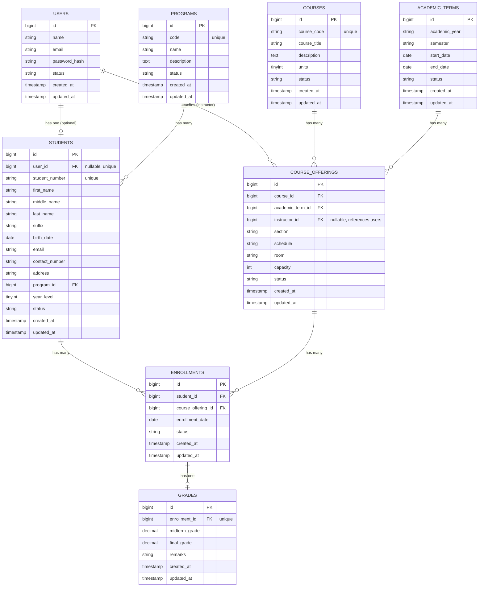

# SIMS API — Entity Relationship Diagram

## Key constraints
- `students.student_number` — unique
- `courses.course_code` — unique
- `students.user_id` — unique (one login account maps to at most one student profile)
- `academic_terms(academic_year, semester)` — unique combination
- `course_offerings(course_id, academic_term_id, section)` — unique combination (prevents duplicate section offerings)
- `enrollments(student_id, course_offering_id)` — unique combination (prevents duplicate enrollment)
- `grades.enrollment_id` — unique (one grade record per enrollment; retakes require a separate enrollment)

## Roles (via spatie/laravel-permission, not a separate table in this diagram)
`administrator`, `registrar`, `instructor`, `student` — assigned to `users` via the package's pivot tables (`model_has_roles`, `roles`, `permissions`).
